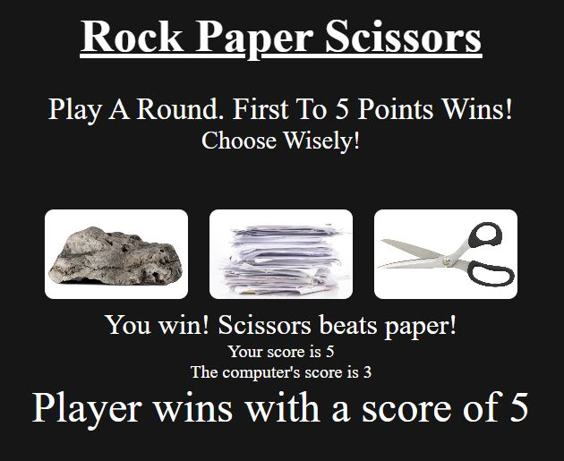

# Rock Paper Sizzor

Using embedded functions, this creates a rock paper scissors game that plays five rounds
and outputs the resultant winner at the end of the five rounds with the score. 

## Demo
### Live: [Here](https://radclifferr.github.io/Rock-Paper-Sizzor/)

